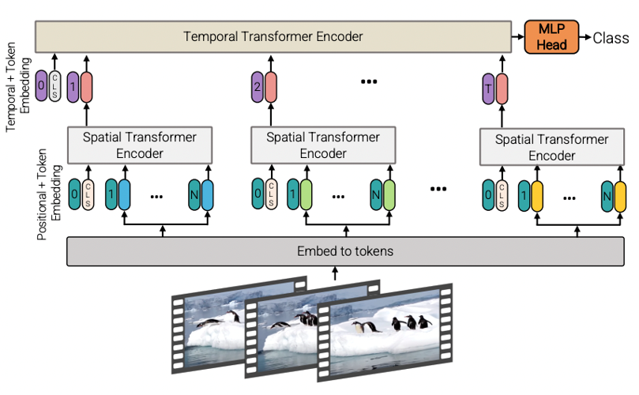
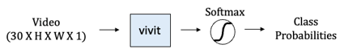

# Speckle Vision Transformer
Pytorch reimplementation of [Google's repository for the ViT model](https://github.com/google-research/vision_transformer) that was released with the paper [An Image is Worth 16x16 Words: Transformers for Image Recognition at Scale](https://arxiv.org/abs/2010.11929) by Alexey Dosovitskiy, Lucas Beyer, Alexander Kolesnikov, Dirk Weissenborn, Xiaohua Zhai, Thomas Unterthiner, Mostafa Dehghani, Matthias Minderer, Georg Heigold, Sylvain Gelly, Jakob Uszkoreit, Neil Houlsby.

This paper show that Transformers applied directly to image patches and pre-trained on large datasets work really well on image recognition task.



Vision Transformer achieve State-of-the-Art in image recognition task with standard Transformer encoder and fixed-size patches. In order to perform classification, author use the standard approach of adding an extra learnable "classification token" to the sequence.



## Reference

* [Google ViT](https://github.com/google-research/vision_transformer)
* [Pytorch Image Models(timm)](https://github.com/rwightman/pytorch-image-models)

## Citations

```bibtex
@article{dosovitskiy2020,
  title={An Image is Worth 16x16 Words: Transformers for Image Recognition at Scale},
  author={Dosovitskiy, Alexey and Beyer, Lucas and Kolesnikov, Alexander and Weissenborn, Dirk and Zhai, Xiaohua and Unterthiner, Thomas and  Dehghani, Mostafa and Minderer, Matthias and Heigold, Georg and Gelly, Sylvain and Uszkoreit, Jakob and Houlsby, Neil},
  journal={arXiv preprint arXiv:2010.11929},
  year={2020}
}
```

## Contact

hyungjae.lim465@gmail.com
